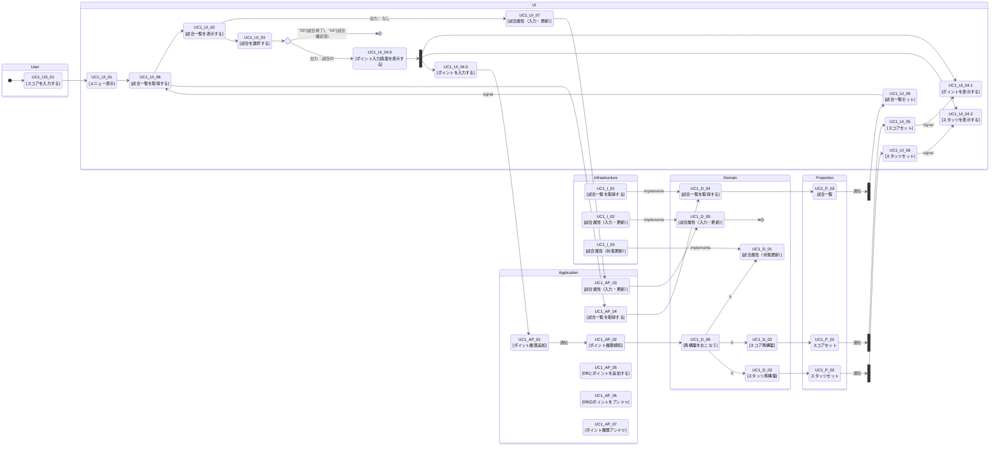

### １．アクティビティ図

- [01_ユースケース図.md](01_%E3%83%A6%E3%83%BC%E3%82%B9%E3%82%B1%E3%83%BC%E3%82%B9%E5%9B%B3.md) の UC1〜UC5 に対応する、業務フロー（ユーザー操作）とシステム処理をレーンで分けたアクティビティ図です。

- 矢印の意味
  - 制御フロー（Control Flow）：「この処理が完了したら、次の処理に進む」＝手順・順序・分岐・合流の流れ
  - オブジェクトフロー（Object Flow）：「データ（成果物）がこの処理から次の処理へ渡る」＝入力/出力データの受け渡し
- 四角の意味
  - 四角：処理（動詞で書く）「保存する」「更新する」「表示する」
  - ひし形：条件判断（疑問形）「不備あり？」「既存の試合？」
  - 丸/開始終了：開始・終了（UMLだと黒丸/二重丸。Mermaidでは ([開始]) などで代用）
  - もし「四角の文言」を統一したいなら、全部を「動詞＋目的語」（例：試合属性を更新する）に揃えると読みやすくなります。
- ID付番
  - UC1-U-xx：ユーザー操作（User lane）
  - UC1-S-xx：システム処理（System lane）
  - UC1-D-xx：分岐（Decision）
  - UC1-START/END：開始・終了（必要なら）
- 状態
  - 試合情報は状態（matchStatus）を持つ
  - "01"(試合開始前)、"02"(試合入力中)、"03"(試合終了)、"04"(試合確定済)

#### [UC1]試合結果を記録する

### ２．アクティビティ一覧
目的：アクティビティ図の各ノードを「仕様項目」に落とし、次工程（画面/API/テスト）で参照可能にする。

|ID|種別|レーン|処理名|処理内容|入力制約|入力|出力|例外時の表示/戻り先|永続化対象|DB(CRUD)|通知・検知|
|---|---|---|---|---|---|---|---|---|---|---|---|
|UC1_US_01|ユーザ|User|メニュー表示|---|---|---|---|---|---|---|---|
|UC1_UI_01|画面|UI|メニュー表示|---|---|---|---|---|---|---|---|
|UC1_UI_02|画面|UI|試合一覧を表示する|登録済の試合一覧を表示する|---|---|---|---|---|R|---|
|UC1_UI_07|画面|UI|試合属性（入力・更新）|---|---|---|---|---|---|CU|---|
|UC1_UI_03|イベント|UI|試合選択|---|---|---|---|---|---|---|---|
|UC1_UI_04.0|画面|UI|ポイント入力画面表示|---|---|---|---|---|---|CU|---|
|UC1_UI_04.1|イベント|UI|ポイント入力|---|---|---|---|---|---|---|---|
|UC1_AP_03|処理|Application|試合属性（入力・更新）|---|---|---|---|---|---|---|---|
|UC1_AP_01|処理|Application|ポイント履歴追加|---|---|---|---|---|---|---|通知①|
|UC1_AP_02|処理|Application|ポイント履歴検知|---|---|---|---|---|---|---|検知①|
|UC1_D_01|処理|Domain|状態更新|---|---|---|---|---|---|U|---|
|UC1_D_02|処理|Domain|スコア再構築|---|---|---|---|---|---|---|---|
|UC1_P_01|処理|Projection|スコアセット|---|---|---|---|---|---|---|通知②|
|UC1_UI_05|画面|UI|スコアセット|---|---|---|---|---|---|---|検知②|
|UC1_D_03|処理|Domain|スタッツ再構築|---|---|---|---|---|---|---|---|
|UC1_P_02|処理|Projection|スタッツセット|---|---|---|---|---|---|---|通知③|
|UC1_UI_06|画面|UI|スタッツセット|---|---|---|---|---|---|---|検知③|
