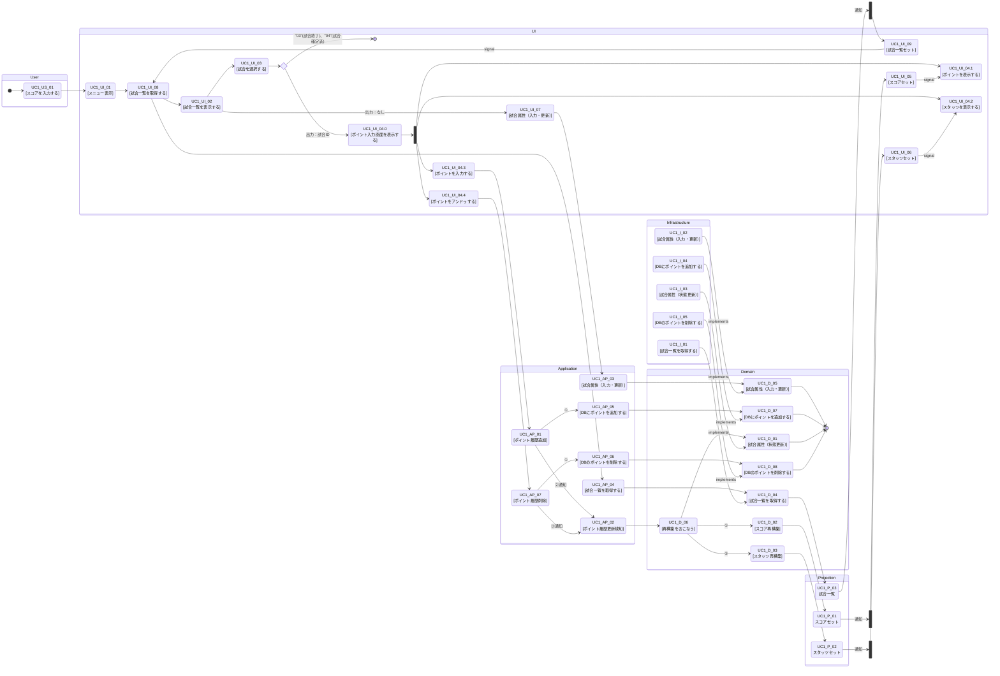

### １．アクティビティ図

- [01_ユースケース図.md](01_%E3%83%A6%E3%83%BC%E3%82%B9%E3%82%B1%E3%83%BC%E3%82%B9%E5%9B%B3.md) の UC1〜UC5 に対応する、業務フロー（ユーザー操作）とシステム処理をレーンで分けたアクティビティ図です。

- 矢印の意味
  - 制御フロー（Control Flow）：「この処理が完了したら、次の処理に進む」＝手順・順序・分岐・合流の流れ
  - オブジェクトフロー（Object Flow）：「データ（成果物）がこの処理から次の処理へ渡る」＝入力/出力データの受け渡し
- 四角の意味
  - 四角：処理（動詞で書く）「保存する」「更新する」「表示する」
  - ひし形：条件判断（疑問形）「不備あり？」「既存の試合？」
  - 丸/開始終了：開始・終了（UMLだと黒丸/二重丸。Mermaidでは ([開始]) などで代用）
  - もし「四角の文言」を統一したいなら、全部を「動詞＋目的語」（例：試合属性を更新する）に揃えると読みやすくなります。
- ID付番
  - UC1-U-xx：ユーザー操作（User lane）
  - UC1-S-xx：システム処理（System lane）
  - UC1-D-xx：分岐（Decision）
  - UC1-START/END：開始・終了（必要なら）
- 状態
  - 試合情報は状態（matchStatus）を持つ
  - "01"(試合開始前)、"02"(試合入力中)、"03"(試合終了)、"04"(試合確定済)

#### [UC1]試合結果を記録する

### ２．アクティビティ一覧
目的：アクティビティ図の各ノードを「仕様項目」に落とし、次工程（画面/API/テスト）で参照可能にする。

|ID|種別|実態|処理名|処理内容|入力制約|入力|出力|例外時の表示/戻り先|永続化対象|DB(CRUD)|通知・購読|
|---|---|---|---|---|---|---|---|---|---|---|---|
|UC1_US_01  |User|ユーザー操作|スコアを入力する|アプリを起動してスコア入力メニューを表示する|---|---|---|---|---|---|---|
|UC1_UI_01  |UI|イベント処理|メニュー表示|---|---|---|---|---|---|---|---|
|UC1_UI_08  |UI|イベント処理|試合一覧を取得する|---|---|---|---|---|---|---|---|
|UC1_UI_09  |UI|処理|試合一覧セット|プロジェクションのイベント通知を購読し、画面表示用の表示モデル（ViewModel）に変換して UI に反映する。|---|ScoreProjectionDto|MatchScoreboardViewModel|---|---|---|購読|
|UC1_UI_02  |UI|---|試合一覧を表示する|---|---|---|---|---|---|---|---|
|UC1_UI_07  |UI|---|試合属性（入力・更新）|---|---|---|---|---|---|---|---|
|UC1_UI_03  |UI|---|試合を選択する|---|---|---|---|---|---|---|---|
|UC1_UI_04.0|UI|---|ポイント入力画面を表示する|---|---|---|---|---|---|---|---|
|UC1_UI_04.1|UI|---|ポイントを表示する|---|---|---|---|---|---|---|---|
|UC1_UI_05  |UI|---|スコアセット|---|---|---|---|---|---|---|---|
|UC1_UI_04.2|UI|---|スタッツを表示する|---|---|---|---|---|---|---|---|
|UC1_UI_06  |UI|---|スタッツセット|---|---|---|---|---|---|---|---|
|UC1_UI_04.3|UI|---|ポイントを入力する|---|---|---|---|---|---|---|---|
|UC1_UI_04.4|UI|---|ポイントをアンドゥする|---|---|---|---|---|---|---|---|
|UC1_AP_03  |Application|---|試合属性（入力・更新）|---|---|---|---|---|---|---|---|
|UC1_AP_04  |Application|---|試合一覧を取得する|---|---|---|---|---|---|---|---|
|UC1_AP_01  |Application|---|ポイント履歴追加|---|---|---|---|---|---|---|---|
|UC1_AP_05  |Application|---|DBにポイントを追加する|---|---|---|---|---|---|---|---|
|UC1_AP_02  |Application|---|ポイント履歴更新検知|---|---|---|---|---|---|---|---|
|UC1_AP_07  |Application|---|ポイント履歴削除|---|---|---|---|---|---|---|---|
|UC1_AP_06  |Application|---|DBのポイントを削除する|---|---|---|---|---|---|---|---|
|UC1_D_04   |Domain|---|試合一覧を取得する|---|---|---|---|---|---|---|---|
|UC1_D_05   |Domain|---|試合属性（入力・更新）|---|---|---|---|---|---|---|---|
|UC1_D_07   |Domain|---|DBにポイントを追加する|---|---|---|---|---|---|---|---|
|UC1_D_08   |Domain|---|DBのポイントを削除する|---|---|---|---|---|---|---|---|
|UC1_D_06   |Domain|---|再構築をおこなう|---|---|---|---|---|---|---|---|
|UC1_D_02   |Domain|---|スコア再構築|---|---|---|---|---|---|---|---|
|UC1_D_03   |Domain|---|スタッツ再構築|---|---|---|---|---|---|---|---|
|UC1_D_01   |Domain|---|試合属性（状態更新）|---|---|---|---|---|---|---|---|
|UC1_P_01   |Projection|---|スコアセット|---|---|---|---|---|---|---|---|
|UC1_P_02   |Projection|---|スタッツセット|---|---|---|---|---|---|---|---|
|UC1_P_03   |Projection|---|試合一覧|---|---|---|---|---|---|---|---|
|UC1_I_01   |Infrastructure|---|試合一覧を取得する|---|---|---|---|---|---|---|---|
|UC1_I_02   |Infrastructure|---|試合属性（入力・更新）|---|---|---|---|---|---|---|---|
|UC1_I_03   |Infrastructure|---|試合属性（状態更新）|---|---|---|---|---|---|---|---|
|UC1_I_04   |Infrastructure|---|DBにポイントを追加する|---|---|---|---|---|---|---|---|
|UC1_I_05   |Infrastructure|---|DBのポイントを削除する|---|---|---|---|---|---|---|---|

